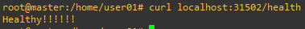
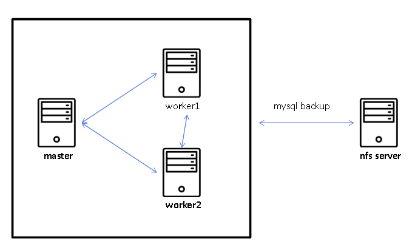
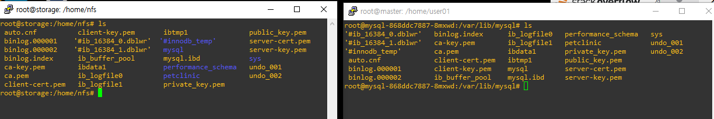
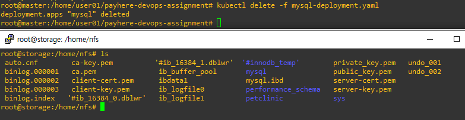
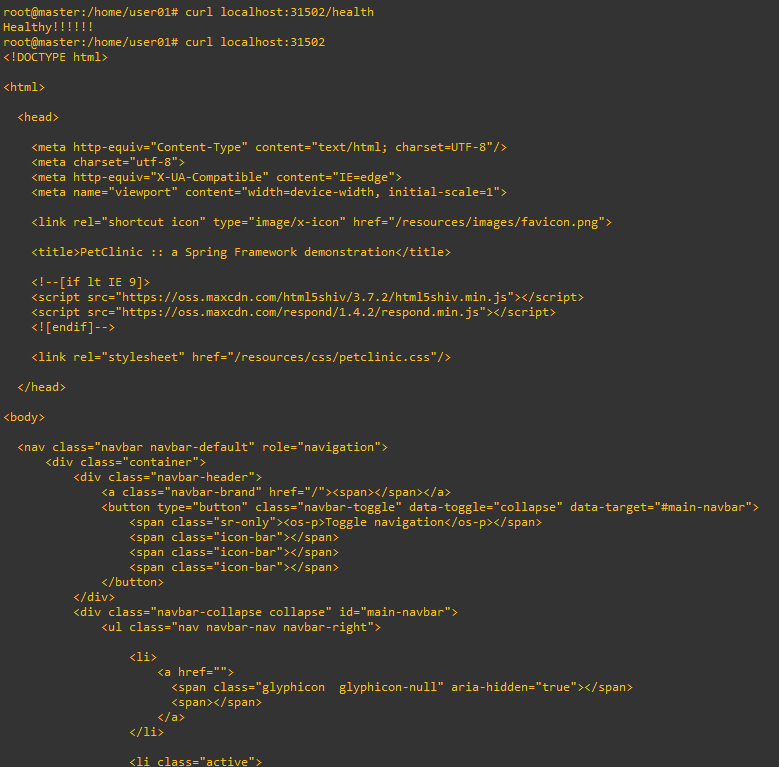
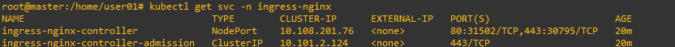
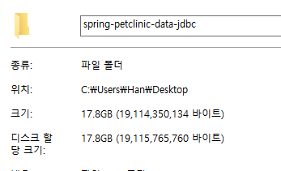

# payhere-devops-assignment
페이히어 데브옵스 엔지니어 과제 제출합니다.

## 1.
<br/>
gradle을 설치하고 아래 명령어를 통해 gradle 환경으로 바꾸었습니다.
이후에는 maven환경을 삭제 해주었습니다.

```
// gradle 버전 : gradle-7.4.2
gradle init
```
<br/>
아래 명령어를 통해 jar파일을 만들어 주었습니다.

```
gradleb build
```

<br/>

이후에는 Dockerfile을 작성해 image를 생성해주고 제 docker hub으로 올렸습니다. 

Dockerfile : https://github.com/doongu/spring-petclinic-data-jdbc/blob/master/Dockerfile<br/>
docker-hub : https://hub.docker.com/repository/docker/doongu/petclinic-spring/general


<br/>
Database는 아래 명령어를 통해 도커 이미지를 빌드 했습니다.

```
docker compose up
```
<br/>
k8s환경에서는 container image를 지정해야 해서 기존 compose파일 환경에 맞게 yaml을 구성해주었습니다. (kompose를 통해 변환하고 참조해 yaml을 작성했습니다.)


```yaml
...
    spec:
      containers:
      - name: mysql
        image: mysql:8.0.26
        env:
          - name: MYSQL_DATABASE
            value: petclinic
          - name: MYSQL_ROOT_PASSWORD
            value: petclinic
        ports:
        - containerPort: 3306
...
```

## 2.
<br/>
어플리케이션의 로그를 저장하기 위해 logback-spring.xml을 추가해주었습니다.<br/>

logback-spring.xml : https://github.com/doongu/spring-petclinic-data-jdbc/blob/master/src/main/resources/logback-spring.xml<br/>

<br/>
이후 컨테이너에 접속해 petclinic.log가 존재하는 것을 확인했고, k8s에선 host에 저장하기 위해 hostpath를 통해 마운트를 진행했습니다.

```yaml
...
        volumeMounts:
        - name: log-volume
          mountPath: /doongu/logs
      volumes:
      - name: log-volume
        hostPath:
          type: Directory
          path: /logs
...
```

<br/>
결과 사진
<p align="center"></p>

## 3.

healthcheck api를 제작했습니다.

healthcheck api : https://github.com/doongu/spring-petclinic-data-jdbc/blob/master/src/main/java/org/springframework/samples/petclinic/health/HealthController.java 

<br/>
10초에 한 번씩 확인하기 위해 livenessProbe 설정을 아래와 같이 해주었습니다.

```yaml
...
          httpGet:
            path: /health
            port: 8080
          initialDelaySeconds: 10
          periodSeconds: 10
...
```

## 4.
terminationGracePeriodSeconds 옵션을 추가해 30초 이내에 종료되지 않으면 SIGKILL이 되도록 하였습니다.

```yaml
...
      terminationGracePeriodSeconds: 30
...
```

## 5.

Deployment에서 RollingUpdate시에 max surge, max unavailable와 replicas를 적절히 설정해주었습니다.
```yaml
...
kind: Deployment
metadata:
  name: petclinic-deployment
  namespace: default
spec:
  replicas: 4
...
  strategy:
    type: RollingUpdate
    rollingUpdate:
      maxSurge: 25%
      maxUnavailable: 25%

```

<br/>
이후로 scale-in, scale-out을 위해 HPA구성을 아래와 같이 했습니다.

```yaml
apiVersion: autoscaling/v2
kind: HorizontalPodAutoscaler
metadata:
  name: my-app-hpa
  namespace: default
spec:
  scaleTargetRef:
    apiVersion: apps/v1
    kind: Deployment
    name: petclinic-deployment
  minReplicas: 1
  maxReplicas: 10
  metrics:
    - type: Resource
      resource:
        name: cpu
        target:
          type: Utilization
          averageUtilization: 50
```

## 6.
Dockerfile 설정을 아래와 같이 해주었습니다.
```Dockerfile
...
RUN useradd -r -u 999 doongu
RUN mkdir -p /doongu
RUN chown doongu /doongu
...
```


## 7.
별도의 nfs서버를 구축해 아래와 같은 구조로 동작하도록 했으며, mysql의 데이터가 저장되는 곳인 /var/lib/mysql을 마운트 해주었습니다.

<p align="center"></p>


```yaml
'''
     volumeMounts:
          - mountPath: /var/lib/mysql
            name: nfs-vol
      volumes:
      - name: nfs-vol
        nfs:
          server: 192.168.45.35
          path: /home/nfs
          readOnly: false
```

<br/>
결과 사진
<p align="center"></p>
해당 파드를 삭제해도 데이터가 영속적으로 잘 저장된 모습입니다.

<p align="center"></p>

## 8.
mysql을 sevice로 배포하고, cluster domain인 mysql.default.svc.cluster.local에 connection하도록 application.properties를 아래와 같이 수정했습니다.

application.properties : https://github.com/doongu/spring-petclinic-data-jdbc/blob/master/src/main/resources/application.properties
```properties
...
spring.datasource.url=jdbc:mysql://mysql.default.svc.cluster.local/petclinic
...
```

## 9.
nginx ingress-controller를 통해 외부에서 접근할 수 있도록 했습니다.

결과 사진
<p align="center"></p>
<p align="center"></p>

## 10.
별도의 namespace를 지정하지 않고 진행했습니다.


## 11.

실행환경

 - ubuntu20.04
 - kubernetes version : 1.28.2
 - docker version : 24.0.7
 - containerd version : 1.6.26 

해당 환경이 갖추어져 있어야하고, ingress-nginx와 HPA를 위한 Metric Server 설치가 별도로 필요합니다.

또한 별도의 nfs서버가 필요하며 그에 따라 payhere-devops-assignment/yamls
/mysql-deployment.yaml의 ip부분을 해당 nfs서버 ip로 바꿔주어야 합니다.


1. petclinic image 가져오기
```
docker pull doongu/petclinic-spring
```

2. mysql:8.0.2 이미지 가져오기
```
docker pull mysql:8.0.2
```

이후에 해당 레포를 clone 받으시면 됩니다.
```
git clone https://github.com/doongu/payhere-devops-assignment.git
```

이제 yamls폴더로 이동 후 차례대로 실행하면 됩니다.
```
kubectl apply -f mysql-deployment.yaml
kubectl apply -f mysql-service.yaml
kubectl apply -f app-deployment.yaml
kubectl apply -f app-service.yaml
kubectl apply -f app-ingress.yaml
kubectl apply -f app-hpa.yaml
```


## 12.
트러블 슈팅

- nfs에 마운트하는 과정에서 권한이 없어 마운트 되지 않는 상황이 발생했습니다. 해당 링크를 참고해 node에 no_root_squash 설정을 해주어 해결하였습니다. ( https://stackoverflow.com/questions/34878574/kubernetes-mysql-chown-operation-not-permitted)

- HPA 구성 시 각종 예제들의 api verion이 제가 설치된 api버전과 맞지 않아 계속해서 오류가 발생했습니다. (저는 autoscaling/v2 를 사용했습니다.) 이는 Redhat openshift문서를 참고해 버전에 맞게 yaml 문법을 수정 하였습니다. ( https://docs.openshift.com/container-platform/4.11/rest_api/autoscale_apis/horizontalpodautoscaler-autoscaling-v2.html#spec-metrics )

- 이외에도 spring을 build하면서 계속해서 빌드는 완료되지 않고 36%에서 멈추는 상황이 발생했습니다. 이는 아래와 같이 점점 용량이 차올라 하드디스크기 꽉 찰 뻔한 위험한 상황을 초래했습니다. 긴박하게 빌드를 멈추고 다시 내려받아 빌드가 되지 않는 지점을 파악해 수정하여 해결했습니다. 정확히 어떤 이유에서 데이터가 쌓였는지는 아직 파악하지 못했습니다.(과제 제출에 급해서 다시 다운로드 했습니다.)




## 13.
개선할점

- yaml파일 관리하는 방식을 더 체계화 했으면 좋았을 것 같습니다. (변수를 통해 설정을 하는 등의 방식)

- master node에서 ingress를 test했는데(curl로 진행), vm이 아닌 다른 환경에서 접속을 확인했으면 더 좋았을 것 같습니다.

- spec.metrics[0].tpye와 같이 yaml파일의 규칙에 대해 미숙해 공식문서를 참고하기 힘들었습니다. 이런 규칙에 대해 좀 더 숙지해야함을 느끼게 되었습니다.